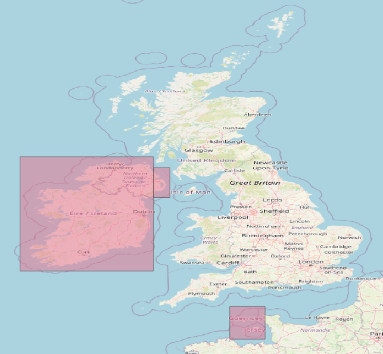

# Country Boundaries

Record Cleaner performs some of its checks on the basis of grid references. When
the  the spatial reference for a record has been supplied as latitude and
longitude it is necessary to perform a conversion.

To do the conversion, we need to know which grid reference system to use -
British, Irish or Channel Islands. That can be decided quickly by seeing if the
point falls within certain bounding boxes as shown in the image.

