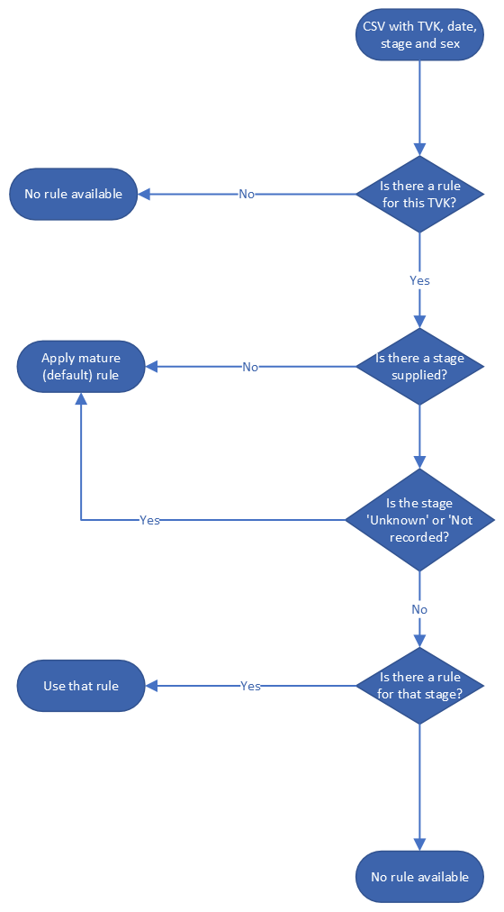

# Phenology Rule

The phenology rule is about the time of year in which a taxon may be observed.
It is possible for a taxon to have multiple rules for different life stages.

The decision about which rule to apply is illustrated below.

The test confirms that the record does not occur prior to or after the
acceptable range.

The date of the record must be wholely out of range for failure.

